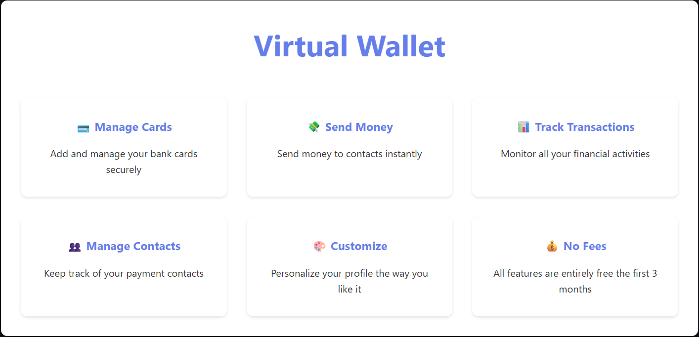
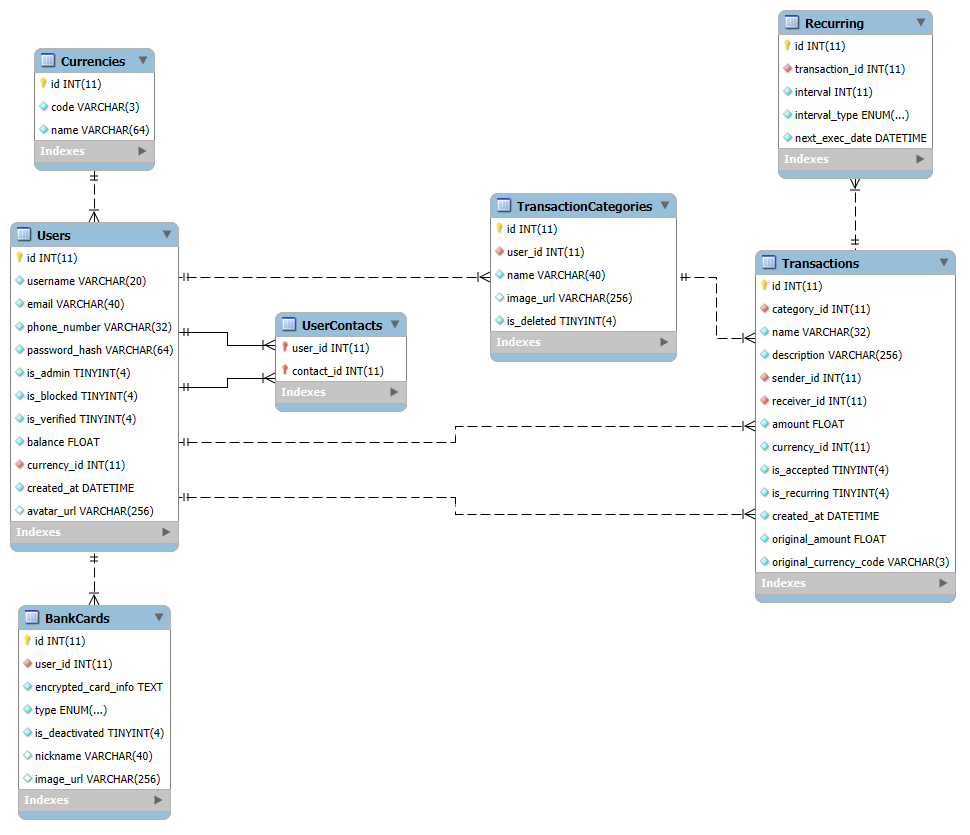

 
[](https://www.python.org/)  [](LICENSE)  

*A comprehensive digital wallet system built with FastAPI and MariaDB, supporting secure money transfers, bank card management, recurring transactions, and multi-currency operations.*  

---

## 📌 Table of Contents  
- [Features](#features)  
- [Project Structure](#project-structure)  
- [Database EER Diagram](#database-eer-diagram)  
- [Quickstart](#quickstart)  
- [Setup](#setup)  
- [API Overview](#api-overview)  
  - [Authentication](#authentication)  
  - [Users](#users)  
  - [Bank Cards](#bank-cards)  
  - [Transactions](#transactions)  
  - [Recurring Transactions](#recurring-transactions)  
  - [Contacts](#contacts)  
  - [Transaction Categories](#transaction-categories)  
  - [Admin Controls](#admin-controls)  
- [License](#license)  

---

## 🔥 Features  

- 🔐 **Secure Authentication:** JWT-based user authentication with password hashing and validation.
- 💳 **Bank Card Management:** Add, encrypt, and manage credit/debit cards with external API integration.
- 💸 **Money Transfers:** Send money between users with real-time balance updates.
- 🔄 **Recurring Transactions:** Schedule automatic recurring payments with customizable intervals.
- 💱 **Multi-Currency Support:** Support for multiple currencies with real-time exchange rates.
- 👥 **Contact Management:** Add and manage payment contacts for quick transfers.
- 🗂️ **Transaction Categories:** Organize transactions with custom categories and icons.
- 📊 **Transaction History:** Comprehensive transaction tracking and filtering.
- 🛠️ **Admin Panel:** User management, verification, and system administration.
- 🔒 **Security Features:** Encrypted card storage, secure password validation, and user verification.

---

## 🏗️ Project Structure  

```sh
Virtual-Wallet/
│
├── routers/                # API and web route definitions
│   ├── api/                # REST API endpoints
│   └── web/                # Web interface routes
├── services/               # Business logic and database operations
├── data/                   # Database models and schema
├── common/                 # Shared utilities (responses, authentication)
├── utils/                  # Utility functions (encryption, validation)
├── static/                 # Static assets (CSS, JS, images)
├── templates/              # HTML templates for web interface
├── config/                 # Configuration and environment setup
├── tests/                  # Unit tests
├── others/                 # Database diagrams and documentation
├── requirements.txt        # Python dependencies
├── main.py                 # FastAPI app entry point
└── recurring_scheduler.py  # Background task scheduler
```

---

## 📊 Database EER Diagram  

  

---

## ⚙️ Setup  

### 🏗️ Steps to Get Started  

1️⃣ **Clone the repository:**  
   ```sh
   git clone <repo-url>
   ```  

2️⃣ **Navigate to the repository root:**  
   ```sh
   cd Virtual-Wallet
   ```  

3️⃣ **Install project dependencies:**  
   ```sh
   pip install -r requirements.txt
   ```
   *Note that a C++ Development kit must be present on your machine for some of the required libraries.*

4️⃣ **Setup a working MariaDB server:**  
   - **Option 1:** 🖥️ Download and install from the [official MariaDB page](https://mariadb.org/download/).  
   - **Option 2:** 🐳 Setup a MariaDB container with Docker:  
     - Pull MariaDB:  
        ```sh
        docker pull mariadb
        ```  
     - Run MariaDB:  
        ```sh
        docker run -p 3306:3306 --name <NAME> -e MYSQL_ROOT_PASSWORD=<PASSWORD> -d mariadb:latest
        ```  

5️⃣ **Configure the project environment:**  
   - Create a `.env` file in the root directory:  

     ```sh
     # Private MariaDB Connection Params
     DB_USER=your_db_user
     DB_PASSWORD=your_db_password
     DB_HOST=your_host_address
     DB_PORT=your_host_port
     DB_NAME=virtual_wallet_db

     # Private JWT Encryption Key
     JWT_ENCRYPT_KEY=your_secret_key

     # Private Bank Cards Encryption Key
     DB_BANK_CARDS_ENCRYPT_KEY=your_bank_cards_secret_key

     # Private Exchange Rate API Key
     EXCHANGE_RATE_API_KEY=your_exchange_rate_api_key

     # External Bank Cards API Configuration
     BANK_CARDS_API_HOST_URL=your_bank_cards_api_host
     BANK_CARDS_API_PORT=your_bank_cards_api_port

      # Private Cloudinary Config (Optional - for image uploads)
     CLDNR_CLOUD_NAME=your_cloudinary_cloud_name
     CLDNR_API_KEY=your_cloudinary_api_key
     CLDNR_API_SECRET=your_cloudinary_api_secret
     ```  

   - Import the schema from `data/db_schema.sql` into your running MariaDB server.  

6️⃣ **Start the server**  
   - **Option 1:** Run the `main.py` file with your preferred IDE.
   - **Option 2:** In CMD or Powershell, navigate to the project root and run:  
     ```sh
     python ./main.py
     ```  
     If everything is configured properly, the web server will be available at: [http://localhost:8000/](http://localhost:8000/)  

---

## 🔗 API Overview  

> 📜 **Interactive API docs available at:** [http://localhost:8000/docs](http://localhost:8000/docs)  

### 🚀 API Endpoints Summary  

| Method | Endpoint                             | Description                  | Auth Required |
| ------ | ------------------------------------ | ---------------------------- | ------------- |
| POST   | `/api/users/login`                   | Authenticate user            | No            |
| POST   | `/api/users/register`                | Register new user            | No            |
| GET    | `/api/users/info`                    | Get current user info        | Yes           |
| GET    | `/api/users/contacts`                | List user's contacts         | Yes           |
| POST   | `/api/users/contacts`                | Add new contact              | Yes           |
| DELETE | `/api/users/contacts/{contact_id}`   | Remove contact               | Yes           |
| GET    | `/api/bank-cards/`                   | List user's bank cards       | Yes           |
| POST   | `/api/bank-cards/`                   | Add new bank card            | Yes           |
| GET    | `/api/bank-cards/{card_id}`          | Get card details             | Yes           |
| PUT    | `/api/bank-cards/{card_id}/withdraw` | Withdraw from card           | Yes           |
| PUT    | `/api/bank-cards/{card_id}/deposit`  | Deposit to card              | Yes           |
| GET    | `/api/transactions/`                 | List transactions            | Yes           |
| POST   | `/api/transactions/`                 | Create new transaction       | Yes           |
| GET    | `/api/transactions/{transaction_id}` | Get transaction details      | Yes           |
| GET    | `/api/categories/`                   | List transaction categories  | Yes           |
| POST   | `/api/categories/`                   | Create new category          | Yes           |
| GET    | `/api/recurring/`                    | List recurring transactions  | Yes           |
| POST   | `/api/recurring/`                    | Create recurring transaction | Yes           |

---

### 🔑 Authentication

All authenticated endpoints require a user token (`u-token`) in the request headers.

---

### 👥 Users

#### **POST** `/api/users/login`
- **Purpose:** Authenticate an existing user.
- **Request Body:** User credentials (username and password).
- **Response:** User authentication token (`u-token`).

#### **POST** `/api/users/register`
- **Purpose:** Create a new user account.
- **Request Body:** User credentials (username, email, phone, password, currency).
- **Response:** Account creation status.

#### **GET** `/api/users/info`
- **Purpose:** Retrieve current user's profile information.
- **Authentication:** Required (`u-token`).
- **Response:** User profile data including balance and currency.

---

### 💳 Bank Cards

#### **GET** `/api/bank-cards/`
- **Purpose:** Retrieve user's bank cards.
- **Authentication:** Required (`u-token`).
- **Response:** List of user's bank cards.

#### **POST** `/api/bank-cards/`
- **Purpose:** Add a new bank card.
- **Authentication:** Required (`u-token`).
- **Request Body:** Card details (number, expiration, holder, CVV, type).

#### **GET** `/api/bank-cards/{card_id}`
- **Purpose:** Get detailed information about a specific card.
- **Authentication:** Required (`u-token`).
- **Response:** Card details including balance.

#### **PUT** `/api/bank-cards/{card_id}/withdraw`
- **Purpose:** Withdraw funds from card to user balance.
- **Authentication:** Required (`u-token`).
- **Request Body:** Withdrawal amount and currency.

#### **PUT** `/api/bank-cards/{card_id}/deposit`
- **Purpose:** Deposit funds from user balance to card.
- **Authentication:** Required (`u-token`).
- **Request Body:** Deposit amount and currency.

---

### 💸 Transactions

#### **GET** `/api/transactions/`
- **Purpose:** Retrieve user's transactions with filtering.
- **Authentication:** Required (`u-token`).
- **Query Parameters:** `category_id`, `search`, `page`, `limit`
- **Response:** Paginated list of transactions.

#### **POST** `/api/transactions/`
- **Purpose:** Create a new transaction.
- **Authentication:** Required (`u-token`).
- **Request Body:** Transaction details (receiver, amount, category, description).

#### **GET** `/api/transactions/{transaction_id}`
- **Purpose:** Get detailed information about a specific transaction.
- **Authentication:** Required (`u-token`).
- **Response:** Transaction details.

---

### 🔄 Recurring Transactions

#### **GET** `/api/recurring/`
- **Purpose:** Retrieve user's recurring transactions.
- **Authentication:** Required (`u-token`).
- **Response:** List of recurring transactions.

#### **POST** `/api/recurring/`
- **Purpose:** Create a new recurring transaction.
- **Authentication:** Required (`u-token`).
- **Request Body:** Recurring transaction details with interval settings.

---

### 👥 Contacts

#### **GET** `/api/users/contacts`
- **Purpose:** Retrieve user's contacts.
- **Authentication:** Required (`u-token`).
- **Response:** List of user's contacts.

#### **POST** `/api/users/contacts`
- **Purpose:** Add a new contact.
- **Authentication:** Required (`u-token`).
- **Request Body:** Contact username.

#### **DELETE** `/api/users/contacts/{contact_id}`
- **Purpose:** Remove a contact.
- **Authentication:** Required (`u-token`).

---

### 🗂️ Transaction Categories

#### **GET** `/api/categories/`
- **Purpose:** Retrieve user's transaction categories.
- **Authentication:** Required (`u-token`).
- **Response:** List of categories.

#### **POST** `/api/categories/`
- **Purpose:** Create a new transaction category.
- **Authentication:** Required (`u-token`).
- **Request Body:** Category name and optional image URL.

---

### 🛠️ Admin Controls

#### **GET** `/api/admin/users`
- **Purpose:** Retrieve all users (admin only).
- **Authentication:** Required (`u-token`).
- **Query Parameters:** `is_verified`, `search`, `page`, `limit`
- **Response:** Paginated list of users.

#### **PATCH** `/api/admin/users/{user_id}/verify`
- **Purpose:** Verify a user account (admin only).
- **Authentication:** Required (`u-token`).

#### **PATCH** `/api/admin/users/{user_id}/block`
- **Purpose:** Block/unblock a user (admin only).
- **Authentication:** Required (`u-token`).

---

## 📝 Notes

- Error responses include appropriate HTTP status codes and error messages.
- Bank card information is encrypted before storage for security.
- Recurring transactions are processed automatically by a background scheduler.
- Currency conversion is supported through external exchange rate APIs.
- Refer to the [Interactive API documentation](http://localhost:8000/docs) for up-to-date request/response formats.

---

## ⚖️ License  

This project is licensed under the MIT License. View 📜 [LICENSE](./LICENSE) for details.
